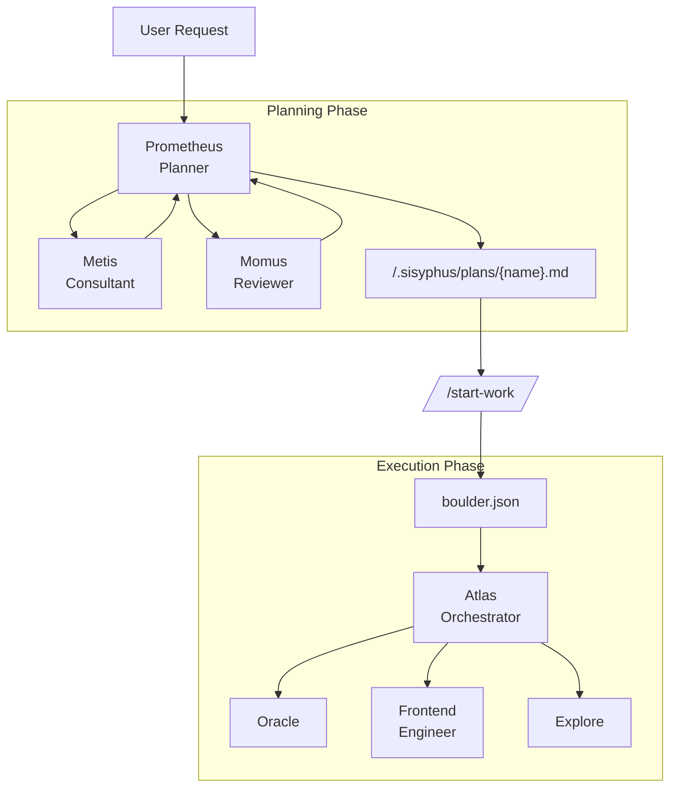

# Oh-My-OpenCode Orchestration Guide

## TL;DR - When to Use What

| Complexity | Approach | When to Use |
|------------|----------|-------------|
| **Simple** | Just prompt | Simple tasks, quick fixes, single-file changes |
| **Complex + Lazy** | Just type `ulw` or `ultrawork` | Complex tasks where explaining context is tedious. Agent figures it out. |
| **Complex + Precise** | `@plan` → `/start-work` | Precise, multi-step work requiring true orchestration. Prometheus plans, Atlas executes. |

**Decision Flow:**

```
Is it a quick fix or simple task?
  └─ YES → Just prompt normally
  └─ NO  → Is explaining the full context tedious?
             └─ YES → Type "ulw" and let the agent figure it out
             └─ NO  → Do you need precise, verifiable execution?
                        └─ YES → Use @plan for Prometheus planning, then /start-work
                        └─ NO  → Just use "ulw"
```

---

## OpenCode Base Orchestrator Compatibility (Fork Strategy)

OpenCode base now supports a **single-session orchestrator** mode that can automatically dispatch tasks when enabled. Oh-My-OpenCode also provides orchestration/dispatching. If both are configured to dispatch, you may see **double-delegation** or “steering wheel” conflicts.

If you want **Oh-My-OpenCode to own dispatching** (recommended when using multi-session orchestration), prefer a **config-first** setup (no env guessing).

### Recommended (config-first): set OpenCode product mode / fork strategy

In your OpenCode config (`opencode.json` / `opencode.jsonc`), set either:

```jsonc
{
  "product": { "mode": "programming" }
}
```

Or explicitly:

```jsonc
{
  "product": { "forkStrategy": "suggest" }
}
```

### Fallback (env-based): set env vars before launching OpenCode

If you cannot (or don’t want to) update OpenCode config, you can still use env vars:

```bash
export OPENCODE_EXPERIMENTAL_ORCHESTRATOR=1
export OPENCODE_ORCHESTRATOR_FORK_STRATEGY=suggest
```

Why `suggest`?
- `auto`: OpenCode base may auto-call `tool:task` in fork orchestrator mode, which can compete with Oh-My-OpenCode’s dispatching.
- `suggest`: OpenCode base only prints *suggested dispatch* output, leaving the actual dispatching to Oh-My-OpenCode.
- `off`: disables base dispatching entirely (useful if you want to be explicit).

### Optional: enable a one-time warning

Oh-My-OpenCode provides an opt-in compatibility warning to help catch misconfigured env combinations. Add to your config:

```jsonc
{
  "experimental": {
    "opencode_orchestrator_compat": { "enabled": true }
  }
}
```

This document provides a comprehensive guide to the orchestration system that implements Oh-My-OpenCode's core philosophy: **"Separation of Planning and Execution"**.

## 1. Overview

Traditional AI agents often mix planning and execution, leading to context pollution, goal drift, and AI slop (low-quality code).

Oh-My-OpenCode solves this by clearly separating two roles:

1. **Prometheus (Planner)**: A pure strategist who never writes code. Establishes perfect plans through interviews and analysis.
2. **Atlas (Executor)**: An orchestrator who executes plans. Delegates work to specialized agents and never stops until completion.

---

## 2. Overall Architecture



---

## 3. Key Components

### 🔮 Prometheus (The Planner)

- **Model**: `anthropic/claude-opus-4-5`
- **Role**: Strategic planning, requirements interviews, work plan creation
- **Constraint**: **READ-ONLY**. Can only create/modify markdown files within `.sisyphus/` directory.
- **Characteristic**: Never writes code directly, focuses solely on "how to do it".

### 🦉 Metis (The Plan Consultant)

- **Role**: Pre-analysis and gap detection
- **Function**: Identifies hidden user intent, prevents AI over-engineering, eliminates ambiguity.
- **Workflow**: Metis consultation is mandatory before plan creation.

### ⚖️ Momus (The Plan Reviewer)

- **Role**: High-precision plan validation (High Accuracy Mode)
- **Function**: Rejects and demands revisions until the plan is perfect.
- **Trigger**: Activated when user requests "high accuracy".

### ⚡ Atlas (The Plan Executor)

- **Model**: `anthropic/claude-opus-4-5` (Extended Thinking 32k)
- **Role**: Execution and delegation
- **Characteristic**: Doesn't do everything directly, actively delegates to specialized agents (Frontend, Librarian, etc.).

---

## 4. Workflow

### Phase 1: Interview and Planning (Interview Mode)

Prometheus starts in **interview mode** by default. Instead of immediately creating a plan, it collects sufficient context.

1. **Intent Identification**: Classifies whether the user's request is Refactoring or New Feature.
2. **Context Collection**: Investigates codebase and external documentation through `explore` and `librarian` agents.
3. **Draft Creation**: Continuously records discussion content in `.sisyphus/drafts/`.

### Phase 2: Plan Generation

When the user requests "Make it a plan", plan generation begins.

1. **Metis Consultation**: Confirms any missed requirements or risk factors.
2. **Plan Creation**: Writes a single plan in `.sisyphus/plans/{name}.md` file.
3. **Handoff**: Once plan creation is complete, guides user to use `/start-work` command.

### Phase 3: Execution

When the user enters `/start-work`, the execution phase begins.

1. **State Management**: Creates `boulder.json` file to track current plan and session ID.
2. **Task Execution**: Atlas reads the plan and processes TODOs one by one.
3. **Delegation**: UI work is delegated to Frontend agent, complex logic to Oracle.
4. **Continuity**: Even if the session is interrupted, work continues in the next session through `boulder.json`.

---

## 5. Commands and Usage

### `@plan [request]`

Invokes Prometheus to start a planning session.

- Example: `@plan "I want to refactor the authentication system to NextAuth"`

### `/start-work`

Executes the generated plan.

- Function: Finds plan in `.sisyphus/plans/` and enters execution mode.
- If there's interrupted work, automatically resumes from where it left off.

---

## 6. Configuration Guide

You can control related features in `oh-my-opencode.json`.

```jsonc
{
  "sisyphus_agent": {
    "disabled": false,           // Enable Atlas orchestration (default: false)
    "planner_enabled": true,     // Enable Prometheus (default: true)
    "replace_plan": true         // Replace default plan agent with Prometheus (default: true)
  },
  
  // Hook settings (add to disable)
  "disabled_hooks": [
    // "start-work",             // Disable execution trigger
    // "prometheus-md-only"      // Remove Prometheus write restrictions (not recommended)
  ]
}
```

### Experimental: OpenCode Base Evidence Bridge (v0 + v2)

**What this is:** When you run `/start-work` (and a plan is actually selected/resumed), Oh-My-OpenCode can optionally read the OpenCode base evidence manifest:

- `.opencode/evidence/<sessionId>/manifest.json`

Then it picks an **allowlist** of "key artifacts" (`kind/path/sha256`) and writes indexes into the plan notepad directory:

- Human-readable Markdown (v0): `.sisyphus/notepads/<plan-name>/opencode-base-evidence.md`
- Machine-readable snapshot (v2): `.sisyphus/notepads/<plan-name>/opencode-base-evidence.json`
- Append-only audit log (v2): `.sisyphus/notepads/<plan-name>/opencode-base-evidence.history.jsonl`

**Why it exists:** Atlas and delegated sub-sessions can quickly find the most important base artifacts (plans, retrieval hits, etc.) without needing to re-run discovery.

**Safety / workflow guarantees:**
- Default behavior is unchanged (feature is config-gated and **disabled by default**).
- Read-only for `.opencode/` (never modifies base evidence).
- Writes only into `.sisyphus/notepads/` (does not change plan file contents or format).
- Markdown is append-only: if `opencode-base-evidence.md` already exists, a new timestamped section is appended (never overwrites).
- Best-effort: any failure is logged and will **not** block `/start-work`.

**v2: change detection (prevents notepad bloat):**
- When `write_json=true`, Oh-My-OpenCode computes a stable `hash` over `(allowlist + entries)`.
- If the new hash matches the previous snapshot:
  - Markdown is **not** appended again
  - history.jsonl does **not** get a new line
  - (optional) `verbose=true` will surface a short "No changes" message in `/start-work` output

**How to enable (v0: Markdown only):**

```jsonc
{
  "experimental": {
    "opencode_base_artifacts_bridge": { "enabled": true }
  }
}
```

**How to enable (v2: JSON + history + change detection):**

```jsonc
{
  "experimental": {
    "opencode_base_artifacts_bridge": {
      "enabled": true,
      "write_json": true
    }
  }
}
```

**Allowlist (defaults):**
- `orchestrator-plan`
- `retrieval-hits`

**Allowlist override (optional):**

```jsonc
{
  "experimental": {
    "opencode_base_artifacts_bridge": {
      "enabled": true,
      "write_json": true,
      "allowlist": ["orchestrator-plan", "retrieval-hits"]
    }
  }
}
```

Notes:
- allowlist affects both the Markdown index and the v2 JSON outputs.
- Path safety checks still apply (entries must be safe relative paths, no `..`, and must be under `.opencode/`).

## 7. Best Practices

1. **Don't Rush**: Invest sufficient time in the interview with Prometheus. The more perfect the plan, the faster the execution.
2. **Single Plan Principle**: No matter how large the task, contain all TODOs in one plan file (`.md`). This prevents context fragmentation.
3. **Active Delegation**: During execution, delegate to specialized agents via `delegate_task` rather than modifying code directly.
